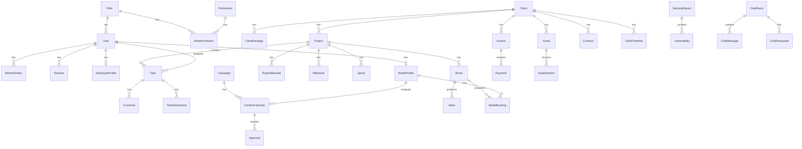

# VegaCore OS – Entity Relationship Diagram

## Core Entities

## Table Index

| Module | Tables |
|--------|--------|
| Auth/RBAC | users, roles, permissions, role_permissions, sessions, refresh_tokens |
| CRM | clients, client_packages, client_timeline |
| Projects | projects, project_members, tasks, task_attachments, comments, milestones, sprints |
| Marketing | content_calendar, campaigns, scripts, approvals |
| Media | shoots, videos, model_bookings |
| Models | model_profiles |
| HR | employee_profiles, attendance, leave_requests, performance_reports |
| Finance | invoices, payments, subscriptions, expenses, payroll |
| Archive | assets, asset_versions, contracts |
| Security | security_reports, vulnerabilities |
| System | notifications, audit_logs, activities, ai_requests, meetings, chat_* |

## Key Relationships

- **User → Role**: Many-to-one with permission inheritance via `role_permissions`
- **Client → Project**: One client, many projects (optional clientId)
- **Project → Task**: Kanban tasks with status, priority, columnOrder
- **ContentCalendar → Approval**: Workflow: Draft → Production → Approval → Published
- **Invoice → Payment**: Financial tracking with status lifecycle
